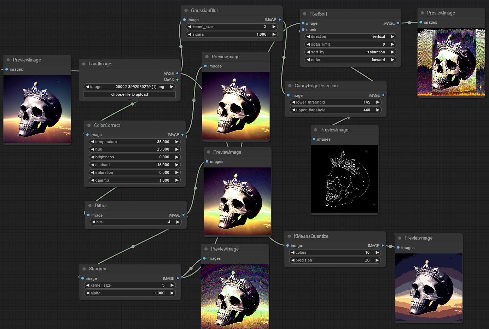

#  ComfyUI-post-processing-nodes

A collection of post processing nodes for [ComfyUI](https://github.com/comfyanonymous/ComfyUI), simply download this repo and drag `post_processing_nodes.py` into your `custom_nodes/` folder

## Node List

 - ArithmeticBlend: Blends two images using arithmetic operations like addition, subtraction, and difference.
 - Blend: Blends two images together with a variety of different modes
 - Blur: Applies a Gaussian blur to the input image, softening the details
 - CannyEdgeDetection: Applies Canny edge detection to the input image
 - ColorCorrect: Adjusts the color balance, temperature, hue, brightness, contrast, saturation, and gamma of an image
 - Dissolve: Creates a grainy blend of two images using random pixels based on a dissolve factor.
 - DodgeAndBurn: Adjusts image brightness using dodge and burn effects based on a mask and intensity.
 - FilmGrain: Adds a film grain effect to the image, along with options to control the temperature, and vignetting
 - Glow: Applies a blur with a specified radius and then blends it with the original image. Creates a nice glowing effect.
 - PencilSketch: Converts an image into a hand-drawn pencil sketch style.
 - PixelSort: Rearranges the pixels in the input image based on their values, and input mask. Creates a cool glitch like effect.
 - Pixelize: Applies a pixelization effect, simulating the reducing of resolution
 - Quantize: Set and dither the amount of colors in an image from 0-256, reducing color information
 - Sharpen: Enhances the details in an image by applying a sharpening filter
 - Solarize: Inverts image colors based on a threshold for a striking, high-contrast effect

## Example workflow

## Combine Nodes

By default `post_processing_nodes.py` should have all of the combined nodes. If you want a subset of nodes, you can run

    python combine_files.py [--files FILES [FILES ...]] [--output OUTPUT]

or just run

    python combine_files.py -h

for more help
