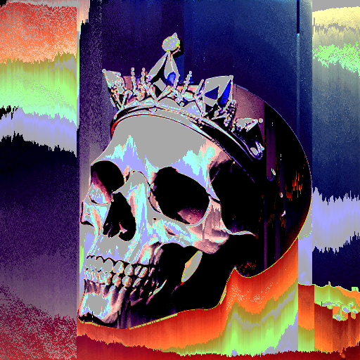
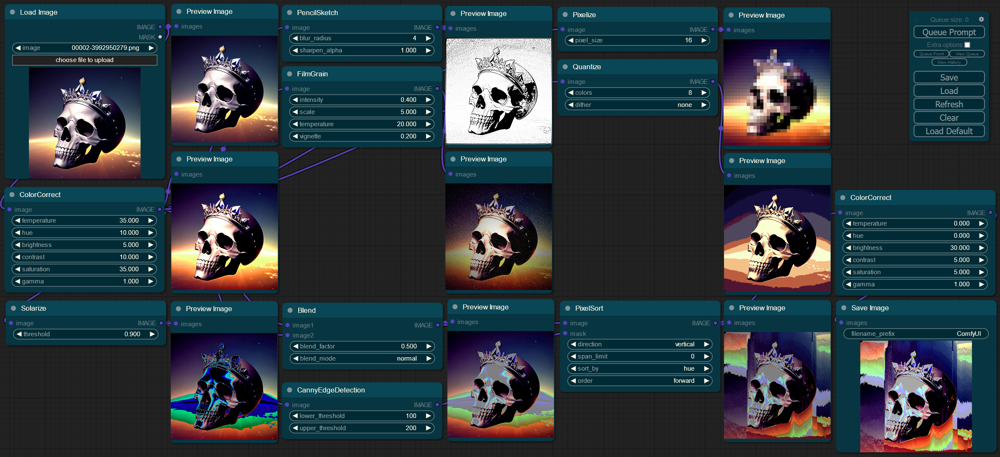

#  ComfyUI-post-processing-nodes

A collection of post processing nodes for [ComfyUI](https://github.com/comfyanonymous/ComfyUI), which enable a variety of visually striking image effects 

## Example Image and Workflow

  
  

Both images have the workflow attached, and are included with the repo. Feel free to submit more examples as well!

---

	
$\Large\color{#00A7B5}\text{Expand Node List}$

 

 - ArithmeticBlend: Blends two images using arithmetic operations like addition, subtraction, and difference.
 - AsciiArt: Transforms an image into being composed of ASCII characters
 - Blend: Blends two images together with a variety of different modes
 - Blur: Applies a Gaussian blur to the input image, softening the details
 - CannyEdgeMask: Creates a mask using canny edge detection
 - Chromatic Aberration: Shifts the color channels in an image, creating a glitch aesthetic
 - $\color{#00A7B5}\textbf{ColorCorrect:}$ Adjusts the color balance, temperature, hue, brightness, contrast, saturation, and gamma of an image
 - $\color{#00A7B5}\textbf{ColorTint:}$ Applies a customizable tint to the input image, with various color modes such as sepia, RGB, CMY and several composite colors
 - Dissolve: Creates a grainy blend of two images using random pixels based on a dissolve factor.
 - DodgeAndBurn: Adjusts image brightness using dodge and burn effects based on a mask and intensity.
 - FilmGrain: Adds a film grain effect to the image, along with options to control the temperature, and vignetting.
 - Glow: Applies a blur with a specified radius and then blends it with the original image. Creates a nice glowing effect.
 - HSVThresholdMask: Creates a mask by thresholding HSV (hue, saturation, and value) channels
 - $\color{#00A7B5}\textbf{KuwaharaBlur:}$ Applies an edge preserving blur, creating a more realistic blur than Gaussian.
 - Parabolize: Applies a color transformation effect using a parabolic formula
 - PencilSketch: Converts an image into a hand-drawn pencil sketch style.
 - $\color{#00A7B5}\textbf{PixelSort:}$ Rearranges the pixels in the input image based on their values, and input mask. Creates a cool glitch like effect.
 - Pixelize: Applies a pixelization effect, simulating the reducing of resolution
 - $\color{#00A7B5}\textbf{Quantize:}$ Set and dither the amount of colors in an image from 0-256, reducing color information
 - Sharpen: Enhances the details in an image by applying a sharpening filter
 - SineWave: Runs a sine wave through the image, making it appear squiggly
 - $\color{#00A7B5}\textbf{Solarize:}$ Inverts image colors based on a threshold for a striking, high-contrast effect
 - Vignette: Applies a vignette effect, putting the corners of the image in shadow

$\color{#00A7B5}\textbf{Bolded Color Nodes}$ are my personal favorites, and highly recommended to expirement with

---

## Install

To install these nodes 

  - Navigate to your `/ComfyUI/custom_nodes/` folder
  - Run `git clone https://github.com/EllangoK/ComfyUI-post-processing-nodes/`

## Combine Nodes

By default `post_processing_nodes.py` should have all of the combined nodes. If you want a subset of nodes, you can run

    python combine_files.py [--files FILES [FILES ...]] [--output OUTPUT]

or just run

    python combine_files.py -h

for more help

## Old Nodes

Some nodes have been have been added to the main repo, feel free to use those instead as they work perfectly fine. Old versions are still kept around for backwards compatability.
